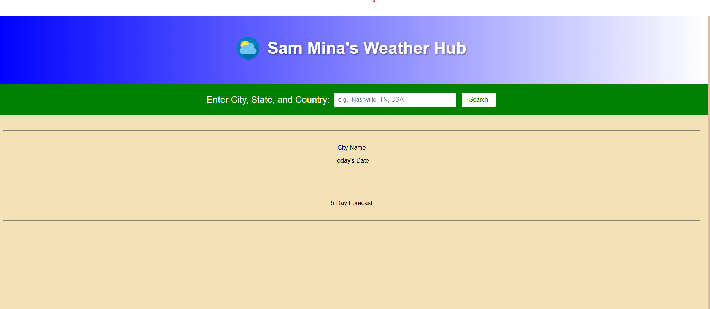
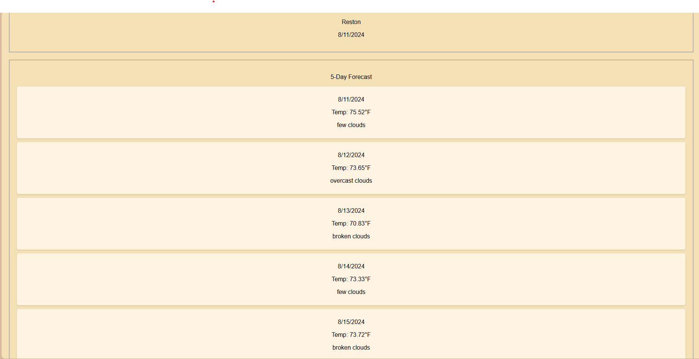

# Weather-Dashboard
Weather Dashboard
I am going to start by laying out the HTML.
I am now decorating with the CSS. I am using a blue and green color scheme because those are Earth colors, which I think is appropriate for weather. 
I found a royalty free icon to use as part of my title bar and I am using the CSS to position it. 
At this point in my studies, I am finding HTML and CSS to be fairly straightforward. The JavaScript is going to require deeper thinking, but I love JavaScript, so I am going to really enjoy that part of the project. When I get done with the CSS, I will do a Git Push and then start pseudocoding the JavaScript. 
I have since added some shadow in the CSS to the title text. I also added some screen size responsiveness to the CSS.
I added  to the HTML.
I went to the weather app website provided in the assignment and created an account and generated my API key. 
I am detailing my thought process and organization for the JavaScript in the pseudocode in the script.js file. 
I finished pseudocoding the JavaScript, which was extremely intense. Filling it out with the actual code is just a matter of syntax and will be much easier. 
TIME FOR A GIT PUSH!!!
I finally finished coding the JavaScript. The app works, but I need to make it display the data in a nicer looking way. But before that there is a more serious problem. There is the way it receives the input of the city. It is confusing. I am going to hunt for a library where I can install a drop down menu to choose from. That way there will be no confusion on how to enter the city. However, before I get into that mess, I'm long due for a GIT PUSH!!!
To make my drop down menu, I found a public repository of the cities and I cloned it to my directory. I am now integrating it into my code using JQuery. 
I got the coding done, but the drop down menu is not working because of CORS restrictions. I am currently exploring my options for getting around those restrictions. 
I am running VS Code as a live server. I also swittched repos for the cities list and I downloaded a city list from the Open Weather website and I put it in my directory. 
I adjusted the code accordingly. 
Time for a GIT PUSH!
I experimented changing the name of the dashboard to just Weather Dashboard and removing the icon to see if it will look more professional. I don't like it. I will change it back. 
I am running into performance issues. I am therefore changing my cities directory to a compressed archive directory and seeing if that will enhance performance. 
I cannot get the drop down menu to work. So, I am going to cut my losses and revert back to an older version of my project. 
I added a placeholder in the HTML so that the page can tell users how to input the search. 
Whew! What a messy and difficult project. But I am finally ready to declare it complete and git push this thing. 
I tested it and the page works well. However, it kept refreshing and deleting my searches. So I added e as the argument to the click event listener on the search button and then added the line e.preventDefault(); below that. I tested it again and it fixed the problem. Now for Git Push. 
I added HTML, CSS, and JS to make up for the missing weather information pointed out by the grader that I initially missed. And I also created a storage history at the bottom for previously searched cities. 

